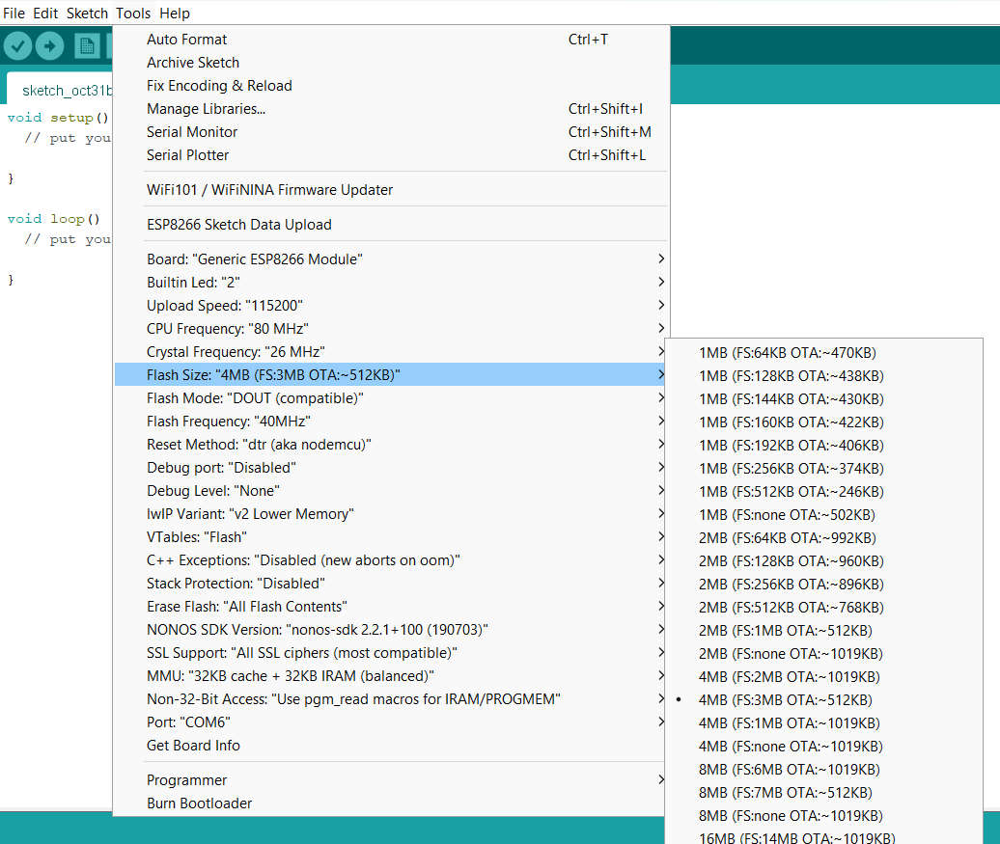
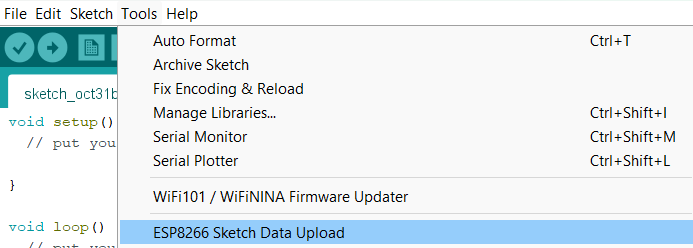
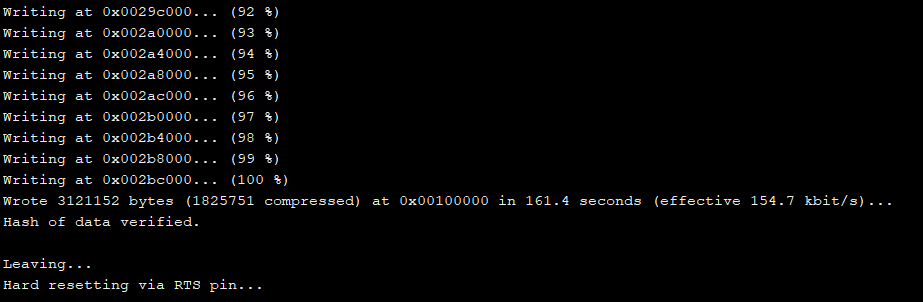
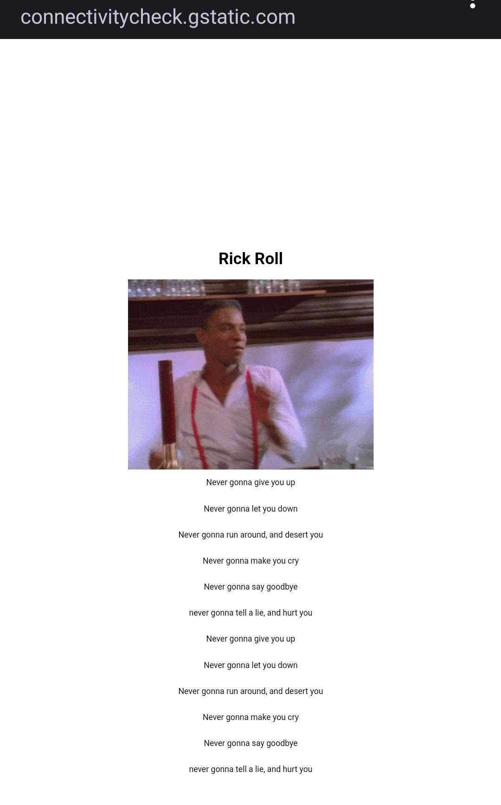

# ESP8266_rickroll

## Description

 This is a simple captive portal for ESP8266. When you connect to the ESP8266 AP, you will be redirected to the captive portal where is rick roll gif.

## Add ESP8266 Board Manager URL:

Go to "File" > "Preferences" in the Arduino IDE.
In the "Additional Boards Manager URLs" field, add this URL:
`http://arduino.esp8266.com/stable/package_esp8266com_index.json`

Click "OK" to close the Preferences window.

## Install the ESP8266 Board Package:

Go to "Tools" > "Board" > "Boards Manager."
In the Boards Manager, type "esp8266" in the search bar.
Click on "esp8266 by ESP8266 Community" and click the "Install" button.
Select ESP8266 Board:

**After installation, go to "Tools" > "Board" and select your ESP8266 board model (e.g.,NodeMCU, Wemos D1 Mini, etc.).**

## Choose the Appropriate COM Port:

Connect your ESP8266 board to your computer via USB.
In the Arduino IDE, go to "Tools" > "Port" and select the COM port to which your ESP8266 is connected.

## Upload the Sketch
Upload the sketch to your ESP8266 board.
>You can edit css on webserver in the code.

>You can change SSID (wifi name) and add password in the code.

## Use Arduino ESP8266 filesystem uploade 
In your Arduino sketchbook directory, create tools directory if it doesn't exist yet.

Put esp8266fs.jar to path `<Disk>\<User>\Documents\Arduino\tools\ESP8266FS\tool`**
Create a directory named `data` in your sketch directory and put any files you want in the file system there
## Select Flash Size
**Select the flash size of your ESP8266 board in Tools > Flash Size menu.
FS (File System) Must be 2MB or more. I used 4MB (FS:3MB OTA:~512KB).**

## Upload the Sketch Data
Might take a few minutes to upload.

## Connect to the ESP8266 AP
Connect to the ESP8266 AP with the SSID and password you set in the code.

## Result
When you connect to the ESP8266 AP, you will be redirected to the captive portal where is rick roll gif.

## Credit
https://github.com/esp8266/arduino-esp8266fs-plugin
